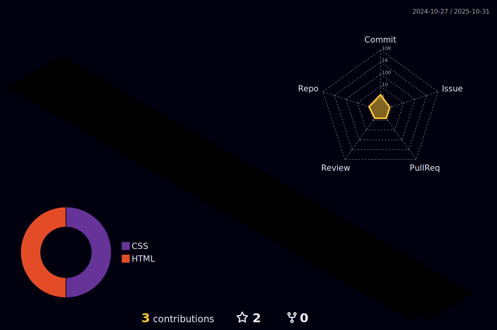

<!-- APRESENTAÇÃO -->
<div id="intro" align="center">
      <!-- CABEÇALHO -->
      <a href="#intro" title=" ">
            
      </a>
      <!-- ESCRITA DINÂMICA -->
      <a href="#intro" title=" ">
            
      </a>
      <!-- REDES SOCIAIS -->
      <div align="center">
            <a href="https://br.linkedin.com/in/cristian-pessotto-351426255" title="Ir para o LinkedIn?">
                  
            </a>
            <a href="https://www.instagram.com/qravattacker/" title="Ir para o Instagram?">
                  
            </a>
            <a href="https://twitter.com/QravaTTacker" title="Ir para o Twitter?">
                  
            </a>
            <a href="https://www.youtube.com/@qravattacker" title="Ir para o YouTube?">
                  
            </a>
      </div>
      <div align="center">
            <a href="#intro">
                  
            </a>
      </div>
      <a href="#intro" title=" "></a>
</div>

```js
const qravattacker {
      name: "Cristian Pessotto",
      age: 21,
      email: "cristianpessotto88@gmail.com",
      job: "Fullstack",
      address: "Paraná"
};
```

<!-- RESUMO -->
<div>
      <p align="justify">
            <em><strong>Eai... como vai?</strong></em><br>
            Me chamo <del>Cristian</del> <ins>QravaTTacker</ins>, espero que esteja bem! Esse é o meu perfil do Github <strong>dedicado para compartilhar meus estudos</strong> e provavelmente a rede que mais pretendo ficar ativo.<br/>
            Não sou apegado à nenhuma linguagem, por esse motivo sempre estou estudando um pouco de tudo. Sou aquilo que chamam de <strong>profissional generalista</strong>. Comecei com <strong>Python</strong> durante o ensino médio por hobby, depois parti para <strong>C</strong> na faculdade e atualmente estou estudando Estruturas de Dados e OOP com <strong>Java</strong>. Além disso, foco uma parcela dos meus estudos em desenvolvimento web com <strong>PHP</strong> e <strong>JS</strong> para me tornar um futuro desenvolvedor Fullstack.
      </p>
      <a href="#intro" title=" "></a>
</div>

```java
Developer qttck = new Developer();

qttck.languages = new ArrayList<>(
      Arrays.asList(
            "Javascript",
            "PHP",
            "Java"
      )
);

qttck.frameworksAndLibs = new ArrayList<>(
      Arrays.asList(
            "React",
            "Laravel",
            "Spring",
            "Bootstrap"
      )
);
```

<!-- SPOTIFY -->
<div id="song">
      <a href="#song" title="🎶"></a>
      <h3>
            <em><strong>Escute comigo</strong></em>
            <a href="#song" title=" "></a>
      </h3>
      <p>Sou muito eclético quando se trata de música, mas dificilmente você vai ouvir pagode ou sertanejo aqui...</p>
      <a href="https://spotify-github-profile.vercel.app/api/view?uid=31rkyoczqj5ax3mrymmjusvvdode&redirect=true"       
            title="Ir para o Spotify?">
            
      </a>
      <hr/>
</div>

<!-- ESTATÍSTICAS -->
<div align="center">
      <h2 id="statistics">
            <em><strong>Minhas Estatísticas</strong></em>
            <a href="#statistics" title=" "></a>
      </h2>
      <!-- LANGUAGES + STATS -->
      <details open>
            <summary align="left">
                  <em><strong>Commits</strong></em> 💚
                  <a href="#statistics">
                        
                  </a>
            </summary>
      </details>
      <!-- LANGUAGES + STATS -->
      <details open id="langs-stats">
            <summary align="left">
                  <em><strong>Linguagens utilizadas + Status</strong></em> 💻
            </summary>
            </br>
            <a href="#langs-stats">
                  
            </a>
            <a href="#langs-stats">
                  
            </a>
      </details>
       <!-- STREAK -->
      <details id="streak">
            <summary align="left">
                  <em><strong>Sequências de commits</strong></em> ⚡
            </summary>
            </br>
            <a href="#streak">
                  
            </a>
      </details>
      <!-- GRÁFICO -->
      <details id="graph">
            <summary align="left">
                  <em><strong>Commits no último mês</strong></em> 📅
            </summary>
            </br>
            <a href="#graph">
                  
            </a>
      </details>
      <!-- TROFÉUS -->
      <details id="trophy">
            <summary align="left">
                  <em><strong>Troféus conquistados</strong></em> 🏆
            </summary>
            </br>
            <a href="#trophy">
                  
            </a>
      </details>
      <!-- REPOSITÓRIOS -->
      <details id="repo">
            <summary align="left">
                  <em><strong>Repositórios</strong></em> 📂
            </summary>
            </br>
            <a href="https://github.com/qravattacker/basic-tools">
                  
            </a>
      </details>
      <hr/>
</div>

<!--
<div id="tools" align="center">
      <h2 id="tools">
            <em><strong>Ferramentas e Plataformas</strong></em>
            <a href="#tools" title=" "></a>
      </h2>
      <table width="100%">
            <tr align="center">
                  <th>Linguagens</th>
                  <td>
                        <a href="#tools" title=" ">
                              
                        </a>
                  </td>
                  <td>
                        <a href="#tools" title=" ">
                              
                        </a>
                  </td>
                  <td>
                        <a href="#tools" title=" ">
                              
                        </a>
                  </td>
            </tr>
            <tr align="center">
                  <th>Frameworks</th>
                      <td>
                        <a href="#tools" title=" ">
                              
                        </a>
                  </td>
                  <td>
                        <a href="#tools" title=" ">
                              
                        </a>
                  </td>
                  <td>
                        <a href="#tools" title=" ">
                              
                        </a>
                  </td>
                  <td>
                        <a href="#tools" title=" ">
                              
                        </a>
                  </td>
            </tr>
            <tr align="center">
                  <th>Web Tools</th>
                  <td>
                        <a href="#tools" title=" ">
                              
                        </a>
                  </td>
                  <td>
                        <a href="#tools" title=" ">
                              
                        </a>
                  </td>
                  <td>
                        <a href="#tools" title=" ">
                              
                        </a>
                  </td>
            </tr>
            <tr align="center">
                  <th>Banco de Dados</th>
                  <td>
                        <a href="#tools" title=" ">
                              
                        </a>
                  </td>
                  <td>
                        <a href="#tools" title=" ">
                              
                        </a>
                  </td>
                  <td>
                        <a href="#tools" title=" ">
                              
                        </a>
                  </td>
            </tr>
            <tr align="center">
                  <th>Ambiente de Trabalho</th>
                  <td>
                        <a href="#tools" title=" ">
                              
                        </a>
                  </td>
                  <td>
                        <a href="#tools" title=" ">
                              
                              
                        </a>
                  </td>
                  <td>
                        <a href="#tools" title=" ">
                              
                        </a>
                  </td>
                   <td>
                        <a href="#tools" title=" ">
                              
                        </a>
                  </td>
                  <td>
                        <a href="#tools" title=" ">
                              
                        </a>
                  </td>
            </tr>
            <tr align="center">
                  <th>Other Tools</th>
                  <td>
                        <a href="#tools" title=" ">
                              
                        </a>
                  </td>
                  <td>
                        <a href="#tools" title=" ">
                              
                        </a>
                  </td>
                  <td>
                        <a href="#tools" title=" ">
                              
                        </a>
                  </td>
                  <td>
                        <a href="#tools" title=" ">
                              
                        </a>
                  </td>
                  <td>
                        <a href="#tools" title=" ">
                              
                        </a>
                  </td>
            </tr>
      </table>
</div>-->

<!-- LINGUAGENS E FERRAMENTAS -->
<div align="center">
      <h2 id="tools">
            <em><strong>Minhas Ferramentas e Linguagens</strong></em>
            <a href="#tools" title=" ">
                  
            </a>
      </h2>
      <table width="100%">
            <tr align="center">
                  <th>
                        Front-end
                  </th>
                  <td>
                        <a href="#tools" >
                              
                        </a>
                  </td>
            </tr>
            <tr align="center">
                  <th>
                        Back-end
                  </th>
                  <td>
                        <a href="#tools" >
                              
                        </a>
                  </td>
            </tr>
            <tr align="center">
                  <th>
                        Frameworks and Libs
                  </th>
                  <td>
                        <a href="#tools" >
                              
                        </a>
                  </td>
            </tr>
            <tr align="center">
                  <th>
                        Data Base
                  </th>
                  <td>
                        <a href="#tools" >
                              
                        </a>
                  </td>
            </tr>
            <tr align="center">
                  <th>
                        Tools
                  </th>
                  <td>
                        <a href="#tools" >
                              
                        </a>
                  </td>
            </tr>
            <tr align="center">
                  <th>
                        Code Editors/IDE
                  </th>
                  <td>
                        <a href="#tools" >
                              
                        </a>
                  </td>
            </tr>
            <tr align="center">
                  <th>
                        Workspace
                  </th>
                    <td>
                        <div align="center" title="Workspace">
                              <a href="#tools" title=" ">
                                    
                              </a> 
                              &nbsp;
                              <a href="#tools" title=" ">
                                    
                                    <!--  -->
                              </a>
                        </div>
                  </td>
            </tr>
            <tr align="center">
                  <th>
                        Command Line
                  </th>
                  <td>
                        <a href="#tools" >
                              
                        </a>
                  </td>
            </tr>
            <tr align="center">
                  <th>
                        Já estudei
                  </th>
                  <td>
                        <a href="#tools" >
                              
                        </a>
                  </td>
            </tr>
      </table>
</div>

<!-- REFERÊNCIAS -->
<div>
      <a href="#tools" title=" "></a>
      <em>
      <strong>
      <details id="api">
            <summary>
                  Repositórios, API's e Ferramentas para o README
            </summary>
            <ul>
                  <li>
                        Cabeçalho e rodapé 👉🏼
                        <a href="https://github.com/kyechan99/capsule-render">github</a>
                  </li>
                  <li>
                        Escrita dinâmica 👉🏼
                        <a href="https://github.com/DenverCoder1/readme-typing-svg">github</a>
                        ou
                        <a href="https://readme-typing-svg.demolab.com/demo/">web</a>
                  </li>
                  <li>
                        Snake Tutorial 👉🏼
                        <a href="https://github.com/bylickilabs/Readme-Readme">github</a>
                  </li>
                  <li>
                        Música do Spotify 👉🏼
                        <a href="https://github.com/kittinan/spotify-github-profile">github</a>
                  </li>
                  <li>
                        Commits 👉🏼
                        <a href="https://github.com/yoshi389111/github-profile-3d-contrib/tree/main">github</a>
                  </li>
                  <li>
                        Linguagens e status 👉🏼
                        <a href="https://github.com/anuraghazra/github-readme-stats">github</a>
                  </li>
                  <li>
                        Sequências de commits 👉🏼
                        <a href="https://github.com/DenverCoder1/github-readme-streak-stats">github</a>
                  </li>
                  <li>
                        Gráfico de commits 👉🏼
                        <a href="https://github.com/Ashutosh00710/github-readme-activity-graph">github</a>
                  </li>
                  <li>
                        Troféus conquistados 👉🏼
                        <a href="https://github.com/ryo-ma/github-profile-trophy">github</a>
                  </li>
                  <li>
                        Badges de redes sociais 👉🏼
                        <a href="https://github.com/badges/shields">github</a>
                        ou
                        <a href="https://shields.io/badges">web</a>
                  </li>
                  <li>
                        Ícones 👉🏼
                        <a href="https://github.com/tandpfun/skill-icons">github</a>
                        ou
                        <a href="https://skillicons.dev">web</a>
                  </li>
                  <li>
                        Outra opção de ícones 👉🏼
                        <a href="https://github.com/devicons/devicon">github</a>
                        ou
                        <a href="https://devicon.dev/">web</a>
                  </li>
                  <li>
                        Emojis 👉🏼
                        <a href="https://giphy.com/Emoji">Giphy</a>
                  </li>
            </ul>
      </details>
      </strong>
      </em>
      <a href="#api" title=" ">
            
      </a>
</div>
